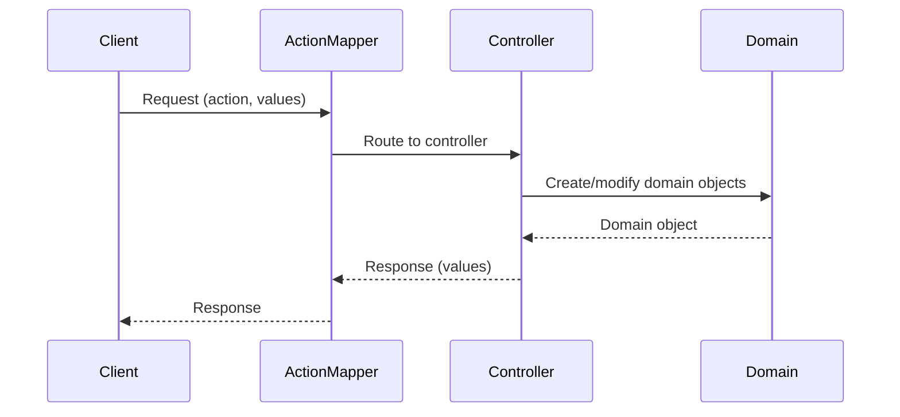
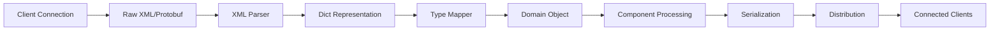

## Overview

FreeTAKServer (FTS) uses a Model-View-Controller (MVC) pattern with a Model-Driven Architecture (MDA) approach. The architecture is built on the DigitalPy framework and follows enterprise design patterns for modularity, scalability, and maintainability.

## Architectural Layers

### MVC Pattern

FTS implements a clear separation of concerns:

<AccordionGroup>
  <Accordion title="Model Layer">
    - **Domain Model**: CoT (Cursor on Target) objects generated from UML models
    - **Protocol Objects**: Base class `FTSProtocolObject` for all domain entities
    - **Core Domain**: Event, Point, Detail and other fundamental CoT components
    - **Location**: `FreeTAKServer/model/` and `FreeTAKServer/components/core/domain/`
  </Accordion>

  <Accordion title="Controller Layer">
    - **Service Controllers**: Handle business logic for each service (TCP CoT, SSL CoT, REST API)
    - **CoT Controllers**: Process specific CoT types (presence, chat, emergency)
    - **Serialization Controllers**: XML/JSON serialization and deserialization
    - **Location**: `FreeTAKServer/controllers/` and service-specific controllers
  </Accordion>

  <Accordion title="View Layer">
    - **REST API Views**: Flask-based endpoints for web interface
    - **WebSocket Handlers**: Real-time communication via SocketIO
    - **Response Formatters**: XML and JSON output formatting
    - **Location**: `FreeTAKServer/services/rest_api_service/views/`
  </Accordion>
</AccordionGroup>

## Core Architecture Components

### DigitalPy Framework Integration

FTS is built on top of DigitalPy, which provides:

```python
# FreeTAKServer/controllers/services/FTS.py
class FTS(DigitalPy):
    def __init__(self):
        super().__init__()
        # Service initialization
        self.SSLCoTService = None
        self.CoTService = None
        self.TCPDataPackageService = None
        # ... other services
```

**Key Features**:
- **Service Management**: Dynamic service registration and lifecycle management
- **Action Mapper**: Routes requests to appropriate controllers
- **Object Factory**: Dependency injection and object creation
- **Component System**: Modular component architecture

### Domain Model Architecture

#### CoT Node System

All CoT objects inherit from `CoTNode`, which provides tree-based data structure:

```python
# FreeTAKServer/components/core/abstract_component/cot_node.py:8-15
class CoTNode(Node, FTSProtocolObject):
    def __init__(self, node_type, configuration, model, oid=None):
        # Dictionary containing CoT attributes
        self.cot_attributes = {}
        # XML representation of the CoT
        self.xml: etree.ElementTree = etree.Element(self.__class__.__name__)
        self.text = ""
        super().__init__(node_type, configuration, model, oid)
```

**Key Characteristics**:
- Parent-child relationship management
- XML serialization support
- Property-based attribute access via `@CoTProperty` decorator
- Support for nested CoT structures

#### Event Model

The Event class is the root CoT object:

```python
# FreeTAKServer/components/core/domain/domain/_event.py:16-44
class Event(CoTNode):
    def __init__(self, configuration: Configuration, model, oid=None):
        super().__init__(self.__class__.__name__, configuration, model, oid)
        
        self.cot_attributes["version"] = None  # Schema version (e.g., 2.0)
        self.cot_attributes["uid"] = None      # Globally unique identifier
        self.cot_attributes["type"] = None     # Hierarchical event type
        self.cot_attributes["how"] = None      # Coordinate generation method
        self.cot_attributes["stale"] = None    # Expiration timestamp
        self.cot_attributes["start"] = None    # Start validity timestamp
        self.cot_attributes["time"] = None     # Event generation timestamp
```

**Event Structure**:
- **Attributes**: version, uid, type, how, time, start, stale
- **Children**: point (location), detail (additional data)
- **Properties**: Exposed via `@CoTProperty` decorator with getters/setters

### Request-Response Pattern

FTS uses an action-based request-response pattern:



**Implementation Example**:

```python
# Request creation
request = ObjectFactory.get_new_instance("request")
request.set_action("XMLToDict")
request.set_value("message", xml_string)

# Action mapping
actionmapper = ObjectFactory.get_instance("syncactionMapper")
response = ObjectFactory.get_new_instance("response")
actionmapper.process_action(request, response)

# Response retrieval
result = response.get_value("dict")
```

## Service Architecture

### Service Lifecycle

Each service extends `DigitalPyService`:

```python
# FreeTAKServer/services/tcp_cot_service/tcp_cot_service_main.py:73-97
class TCPCoTServiceMain(DigitalPyService):
    def __init__(
        self,
        service_id,
        subject_address,
        subject_port,
        subject_protocol,
        integration_manager_address,
        integration_manager_port,
        integration_manager_protocol,
        formatter: Formatter,
    ):
        super().__init__(
            service_id,
            subject_address,
            subject_port,
            subject_protocol,
            integration_manager_address,
            integration_manager_port,
            integration_manager_protocol,
            formatter
        )
```

**Service Responsibilities**:
1. **Connection Management**: Accept and manage client connections
2. **Message Processing**: Parse, validate, and route CoT messages
3. **Event Distribution**: Broadcast messages to connected clients
4. **State Management**: Track active clients and sessions

### Multi-Threading Architecture

FTS uses thread pools for concurrent client handling:

```python
# Thread pool for client connections
from multiprocessing.pool import ThreadPool

# Separate threads for:
# - Accepting new connections
# - Receiving data from clients
# - Sending data to clients
# - Processing CoT messages
```

## Data Flow

### CoT Message Processing Pipeline



### XML to Domain Object Conversion

```python
# FreeTAKServer/core/parsers/XMLCoTController.py:64-75
# Serialize XML to etree
event = etree.fromstring(data.xmlString)

# Convert XML to dictionary
request.set_action("XMLToDict")
request.set_value("message", data.xmlString)
actionmapper.process_action(request, response)
data_dict = response.get_value("dict")

# Convert machine-readable type to human-readable
request.set_action("ConvertMachineReadableToHumanReadable")
request.set_value("machine_readable_type", data_dict["event"]["@type"])
actionmapper.process_action(request, response)
```

## Persistence Layer

### Database Architecture

- **ORM**: SQLAlchemy for database abstraction
- **Database Controller**: `FreeTAKServer/core/persistence/DatabaseController.py`
- **Models**: SQLAlchemy models in `FreeTAKServer/model/SQLAlchemy/`

**Persisted Data**:
- User authentication and sessions
- CoT event history
- Mission data and packages
- Video stream metadata
- Client connection information

## Configuration Management

### Main Configuration

```python
# Singleton configuration object
from FreeTAKServer.core.configuration.MainConfig import MainConfig
config = MainConfig.instance()
```

**Configuration Sources**:
- **INI Files**: Primary configuration via `config.ini`
- **Environment Variables**: Override configuration values
- **Command Line Arguments**: Runtime configuration
- **Component Configs**: Component-specific settings

## Telemetry and Monitoring

### OpenTelemetry Integration

```python
from opentelemetry.trace import Status, StatusCode
from digitalpy.core.telemetry.tracer import Tracer

# Tracing support throughout the codebase
# for performance monitoring and debugging
```

### Logging Architecture

```python
from FreeTAKServer.core.configuration.CreateLoggerController import CreateLoggerController
from FreeTAKServer.core.configuration.LoggingConstants import LoggingConstants

loggingConstants = LoggingConstants(log_name="ServiceName")
logger = CreateLoggerController("ServiceName", logging_constants=loggingConstants).getLogger()
```

## Security Architecture

### SSL/TLS Support

- **Certificate Generation**: `AtakOfTheCerts` utility for certificate management
- **SSL Services**: Separate SSL CoT and HTTPS TAK API services
- **Client Authentication**: Certificate-based client authentication

### Authentication and Authorization

- **Flask-Login**: Session management for REST API
- **API Keys**: Token-based authentication support
- **Certificate Auth**: x.509 certificate validation

## Extensibility

The architecture supports extension through:

1. **Component System**: Add new components in `components/extended/`
2. **Service Plugins**: Create new services implementing `DigitalPyService`
3. **CoT Handlers**: Register handlers for specific CoT types
4. **Action Mappers**: Add new actions to the request-response system

## Design Patterns

### Patterns Used

- **MVC**: Model-View-Controller separation
- **Factory**: Object creation via `ObjectFactory`
- **Singleton**: Configuration and service instances
- **Strategy**: Multiple serialization strategies (XML, JSON, Protobuf)
- **Observer**: Event-based message distribution
- **Command**: Action-based request handling
- **Repository**: Database access abstraction

## Performance Considerations

### Optimization Strategies

1. **Connection Pooling**: Reuse database connections
2. **Thread Pools**: Limit thread creation overhead
3. **Caching**: Type mapping and configuration caching
4. **Lazy Loading**: Load domain objects on demand
5. **Asynchronous I/O**: EventLet for concurrent operations

## Related Documentation

<CardGroup cols={2}>
  <Card title="Services" icon="server" href="/concepts/services">
    Learn about FTS service architecture
  </Card>
  <Card title="Components" icon="puzzle-piece" href="/concepts/components">
    Explore the component system
  </Card>
  <Card title="CoT Messages" icon="message" href="/concepts/cot-messages">
    Understand CoT message format
  </Card>
  <Card title="Installation" icon="download" href="/installation">
    Get started with FTS
  </Card>
</CardGroup>