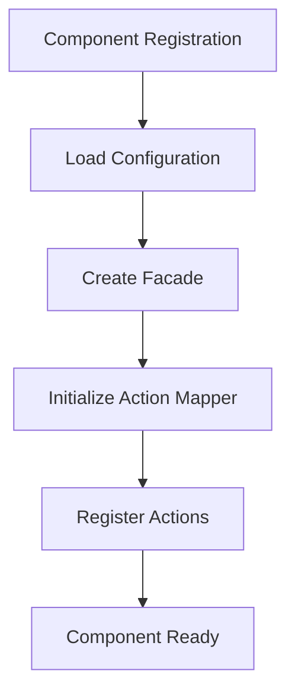

## Component Architecture Overview

FreeTAKServer uses a modular component system built on the DigitalPy framework. Components are self-contained units that handle specific CoT message types and business logic, allowing for extensibility and maintainability.

## Component Types

### Core Components

Core components provide fundamental FTS functionality and cannot be disabled.

**Location**: `FreeTAKServer/components/core/`

<CardGroup cols={2}>
  <Card title="Domain Component" icon="cube">
    **Purpose**: Core CoT domain model
    
    - Event, Point, Detail classes
    - CoT serialization/deserialization
    - Type mapping and conversion
    - XML/JSON parsing
    
    **Location**: `components/core/domain/`
  </Card>
  
  <Card title="Type Component" icon="tag">
    **Purpose**: CoT type mapping
    
    - Machine ↔ Human readable type conversion
    - Type registration and lookup
    - Caching strategies
    - Memory/database mapping
    
    **Location**: `components/core/type/`
  </Card>
  
  <Card title="XML Serializer Component" icon="file-code">
    **Purpose**: XML serialization
    
    - Domain object → XML conversion
    - XML → Domain object parsing
    - Attribute mapping
    - Namespace handling
    
    **Location**: `components/core/xml_serializer/`
  </Card>
  
  <Card title="CoT Parser Component" icon="magnifying-glass">
    **Purpose**: CoT message parsing
    
    - XML parsing and validation
    - Element extraction
    - Error handling
    - Format detection
    
    **Location**: `components/core/cot_parser/`
  </Card>
</CardGroup>

### Extended Components

Extended components provide optional functionality that can be enabled/disabled.

**Location**: `FreeTAKServer/components/extended/`

<Tabs>
  <Tab title="Core Extensions">
    | Component | Purpose | Location |
    |-----------|---------|----------|
    | **CoT Manager** | General CoT processing and routing | `extended/cotmanager/` |
    | **Track Manager** | Position tracking and history | `extended/track_manager/` |
    | **Repeater** | CoT message relay and forwarding | `extended/repeater/` |
  </Tab>
  
  <Tab title="Feature Components">
    | Component | Purpose | Location |
    |-----------|---------|----------|
    | **Mission** | Mission package management | `extended/mission/` |
    | **Emergency** | Emergency alert handling | `extended/emergency/` |
    | **ExCheck** | Checklist management | `extended/excheck/` |
    | **Report** | Reporting and analytics | `extended/report/` |
  </Tab>
  
  <Tab title="Integration">
    | Component | Purpose | Location |
    |-----------|---------|----------|
    | **Federation** | Server-to-server federation | `extended/federation/` |
    | **XMPP Chat** | XMPP chat integration | `extended/xmpp_chat/` |
    | **Files** | File transfer management | `extended/files/` |
  </Tab>
  
  <Tab title="Special">
    | Component | Purpose | Location |
    |-----------|---------|----------|
    | **Master Parrot** | Automated responses | `extended/master_parrot/` |
    | **Companion Parrot** | Client simulation | `extended/companion_parrot/` |
  </Tab>
</Tabs>

## Component Structure

Each component follows a standard directory structure:

```
component_name/
├── __init__.py
├── base/
│   ├── component_name_action_mapper.py
│   └── component_name_domain.py
├── configuration/
│   ├── component_name_constants.py
│   ├── business_rules/
│   └── model_definitions/
├── controllers/
│   ├── component_name_controller.py
│   ├── component_name_general_controller.py
│   └── component_name_persistence.py
├── domain/
│   ├── _event.py
│   ├── _component_property.py
│   └── model_constants/
└── component_name_facade.py
```

### Component Elements

<AccordionGroup>
  <Accordion title="Action Mapper">
    Maps action names to controller methods.
    
    ```python
    # base/companion_parrot_action_mapper.py
    from digitalpy.core.main.controller import Controller
    
    class CompanionParrotActionMapper(Controller):
        def __init__(self):
            super().__init__()
            self.action_mapping = {
                "SendPresence": self.send_presence,
                "ProcessCoT": self.process_cot,
                # ... more actions
            }
    ```
  </Accordion>
  
  <Accordion title="Domain Classes">
    Component-specific domain model extensions.
    
    ```python
    # domain/_event.py
    from FreeTAKServer.components.core.abstract_component.cot_node import CoTNode
    from FreeTAKServer.components.core.abstract_component.cot_property import CoTProperty
    
    class Event(CoTNode):
        """Component-specific event extensions"""
        
        @CoTProperty
        def custom_property(self):
            return self.cot_attributes.get("custom_property", None)
        
        @custom_property.setter
        def custom_property(self, value):
            self.cot_attributes["custom_property"] = value
    ```
  </Accordion>
  
  <Accordion title="Controllers">
    Business logic and processing.
    
    ```python
    # controllers/companion_parrot_controller.py
    from digitalpy.core.main.controller import Controller
    
    class CompanionParrotController(Controller):
        def execute(self, method=None):
            """Execute the specified method"""
            return getattr(self, method)(**self.request.get_values())
        
        def send_presence(self, lat, lon, callsign, **kwargs):
            """Send a presence CoT"""
            # Create event
            event = self.create_presence_event(lat, lon, callsign)
            
            # Serialize and send
            xml = self.serialize_event(event)
            self.send_to_clients(xml)
            
            return event
    ```
  </Accordion>
  
  <Accordion title="Facade">
    Public interface for the component.
    
    ```python
    # companion_parrot_facade.py
    from digitalpy.core.component_management.component_facade import ComponentFacade
    
    class CompanionParrotFacade(ComponentFacade):
        def __init__(self, 
                     sync_action_mapper, 
                     request, 
                     response, 
                     configuration):
            super().__init__(
                sync_action_mapper,
                request,
                response,
                configuration
            )
        
        def send_presence(self, lat, lon, callsign):
            """Public method to send presence"""
            self.request.set_value("lat", lat)
            self.request.set_value("lon", lon)
            self.request.set_value("callsign", callsign)
            self.request.set_action("SendPresence")
            
            self.sync_action_mapper.process_action(
                self.request, 
                self.response
            )
            
            return self.response.get_value("event")
    ```
  </Accordion>
  
  <Accordion title="Configuration">
    Component constants and settings.
    
    ```python
    # configuration/companion_parrot_constants.py
    
    # Component identification
    COMPONENT_NAME = "CompanionParrot"
    COMPONENT_VERSION = "1.0.0"
    
    # Default values
    DEFAULT_STALE_TIME = 300  # 5 minutes
    DEFAULT_TYPE = "a-f-G-E-S"
    DEFAULT_HOW = "m-g"
    
    # Business rules
    MAX_MESSAGE_RATE = 10  # messages per second
    RETRY_COUNT = 3
    ```
  </Accordion>
</AccordionGroup>

## Component Lifecycle

### Registration

Components are registered during FTS initialization:

```python
from digitalpy.core.component_management.impl.component_registration_handler import ComponentRegistrationHandler

# Create registration handler
registration_handler = ComponentRegistrationHandler()

# Register component
registration_handler.register_component(
    component_name="CompanionParrot",
    component_path="FreeTAKServer.components.extended.companion_parrot",
    component_class="CompanionParrotFacade"
)
```

### Initialization



### Processing Flow

```python
# 1. Receive CoT message
raw_cot = receive_from_client()

# 2. Route to component
request = ObjectFactory.get_new_instance("request")
request.set_value("cot_message", raw_cot)
request.set_action("ProcessCoT")

# 3. Component processes
action_mapper = ObjectFactory.get_instance("actionMapper")
response = ObjectFactory.get_new_instance("response")
action_mapper.process_action(request, response)

# 4. Get result
processed_cot = response.get_value("processed_cot")

# 5. Distribute to clients
send_to_all_clients(processed_cot)
```

### Shutdown

```python
# Graceful component shutdown
def shutdown_component(component_name):
    # Get component instance
    component = ObjectFactory.get_instance(component_name)
    
    # Call cleanup method
    if hasattr(component, 'cleanup'):
        component.cleanup()
    
    # Unregister from action mapper
    registration_handler.unregister_component(component_name)
```

## Base Classes

### CoTNode

All CoT domain objects inherit from `CoTNode`:

```python
# FreeTAKServer/components/core/abstract_component/cot_node.py:8-33
class CoTNode(Node, FTSProtocolObject):
    def __init__(self, node_type, configuration, model, oid=None):
        # Dictionary containing CoT attributes
        self.cot_attributes = {}
        # XML representation
        self.xml: etree.ElementTree = etree.Element(self.__class__.__name__)
        self.text = ""
        super().__init__(node_type, configuration, model, oid)
    
    def add_child(self, child):
        """Add child node to CoT structure"""
        if self.validate_child_addition(child):
            self._children[child.get_oid().str_val] = child
            self.cot_attributes[child.__class__.__name__] = child
            child.set_parent(self)
        else:
            raise TypeError("child must be an instance of Node")
```

**Features**:
- Tree-based data structure
- Parent-child relationships
- Attribute storage via `cot_attributes` dict
- XML serialization support
- Property-based access

### CoTProperty Decorator

The `@CoTProperty` decorator marks attributes as CoT properties:

```python
from FreeTAKServer.components.core.abstract_component.cot_property import CoTProperty

class MyCoTNode(CoTNode):
    @CoTProperty
    def callsign(self):
        return self.cot_attributes.get("callsign", None)
    
    @callsign.setter
    def callsign(self, value):
        self.cot_attributes["callsign"] = value
```

**Purpose**:
- Mark serializable properties
- Enable automatic XML generation
- Support property introspection

### Domain Controller

Base controller for domain operations:

```python
# FreeTAKServer/components/core/abstract_component/domain.py:6-66
class Domain(Controller):
    def __init__(self, config_path_template, domain, **kwargs):
        super().__init__(**kwargs)
        self.config_loader = LoadConfiguration(config_path_template)
        self.domain = domain
    
    def create_node(self, message_type, object_class_name, **kwargs):
        """Create a new domain node"""
        configuration = self.config_loader.find_configuration(message_type)
        object_class = getattr(self.domain, object_class_name)
        object_class_instance = object_class(configuration, self.domain)
        self.response.set_value("model_object", object_class_instance)
    
    def add_child(self, node: Node, child, **kwargs):
        """Add child to node"""
        return node.add_child(child)
    
    def get_children_ex(self, id, node: Node, children_type, 
                        values, properties, use_regex=True, **kwargs):
        """Get children matching criteria"""
        self.response.set_value(
            "children",
            node.get_children_ex(
                id, node, children_type, values, properties, use_regex
            )
        )
```

## Creating a Component

### Step 1: Component Structure

```bash
mkdir -p components/extended/my_component/{base,configuration,controllers,domain}
touch components/extended/my_component/__init__.py
touch components/extended/my_component/my_component_facade.py
```

### Step 2: Define Action Mapper

```python
# base/my_component_action_mapper.py
from digitalpy.core.main.controller import Controller

class MyComponentActionMapper(Controller):
    def __init__(self):
        super().__init__()
        self.action_mapping = {
            "ProcessMyCoT": self.process_my_cot,
        }
    
    def process_my_cot(self, cot_event):
        # Process CoT
        pass
```

### Step 3: Create Domain Model

```python
# domain/_event.py
from FreeTAKServer.components.core.abstract_component.cot_node import CoTNode
from FreeTAKServer.components.core.abstract_component.cot_property import CoTProperty

class Event(CoTNode):
    def __init__(self, configuration, model):
        super().__init__(self.__class__.__name__, configuration, model)
    
    @CoTProperty
    def my_property(self):
        return self.cot_attributes.get("my_property", None)
    
    @my_property.setter
    def my_property(self, value):
        self.cot_attributes["my_property"] = value
```

### Step 4: Implement Controller

```python
# controllers/my_component_controller.py
from digitalpy.core.main.controller import Controller

class MyComponentController(Controller):
    def execute(self, method=None):
        return getattr(self, method)(**self.request.get_values())
    
    def process_cot(self, cot_event, **kwargs):
        # Business logic
        processed = self.do_processing(cot_event)
        self.response.set_value("processed_cot", processed)
        return processed
```

### Step 5: Create Facade

```python
# my_component_facade.py
from digitalpy.core.component_management.component_facade import ComponentFacade

class MyComponentFacade(ComponentFacade):
    def process_cot(self, cot_event):
        self.request.set_value("cot_event", cot_event)
        self.request.set_action("ProcessMyCoT")
        
        self.sync_action_mapper.process_action(
            self.request,
            self.response
        )
        
        return self.response.get_value("processed_cot")
```

### Step 6: Register Component

```python
# In FTS initialization
registration_handler.register_component(
    component_name="MyComponent",
    component_path="FreeTAKServer.components.extended.my_component",
    component_class="MyComponentFacade"
)
```

## Component Examples

### Emergency Component

Handles emergency alerts and 911 calls:

**Location**: `components/extended/emergency/`

**Features**:
- Process emergency CoT messages
- Track active emergencies
- Broadcast to all users
- Emergency cancellation

### Mission Component

Manages mission packages and synchronization:

**Location**: `components/extended/mission/`

**Features**:
- Mission creation and management
- Package upload/download
- Mission subscription
- Change tracking
- Layer management

### Track Manager Component

Tracks position history and movement:

**Location**: `components/extended/track_manager/`

**Features**:
- Position history storage
- Track playback
- Dead reckoning
- Stale position cleanup

## Best Practices

<AccordionGroup>
  <Accordion title="Component Design">
    - **Single Responsibility**: Each component handles one specific domain
    - **Loose Coupling**: Components communicate via action mapper
    - **High Cohesion**: Related functionality grouped together
    - **Dependency Injection**: Use ObjectFactory for dependencies
  </Accordion>
  
  <Accordion title="Error Handling">
    ```python
    def process_cot(self, cot_event):
        try:
            # Processing logic
            result = self.do_processing(cot_event)
            self.response.set_value("result", result)
        except ValidationError as e:
            self.logger.error(f"Validation failed: {e}")
            self.response.set_value("error", str(e))
        except Exception as e:
            self.logger.exception("Unexpected error")
            self.response.set_value("error", "Internal error")
    ```
  </Accordion>
  
  <Accordion title="Testing">
    ```python
    import unittest
    from FreeTAKServer.components.extended.my_component.my_component_facade import MyComponentFacade
    
    class TestMyComponent(unittest.TestCase):
        def setUp(self):
            self.component = MyComponentFacade(
                sync_action_mapper=mock_mapper,
                request=mock_request,
                response=mock_response,
                configuration=mock_config
            )
        
        def test_process_cot(self):
            result = self.component.process_cot(test_cot)
            self.assertIsNotNone(result)
    ```
  </Accordion>
  
  <Accordion title="Performance">
    - Cache frequently accessed data
    - Use database connection pooling
    - Implement rate limiting for high-volume components
    - Profile and optimize hot paths
    - Use async operations where appropriate
  </Accordion>
</AccordionGroup>

## Related Documentation

<CardGroup cols={2}>
  <Card title="Architecture" icon="sitemap" href="/concepts/architecture">
    Understand FTS architecture
  </Card>
  <Card title="Services" icon="server" href="/concepts/services">
    Learn about FTS services
  </Card>
  <Card title="CoT Messages" icon="message" href="/concepts/cot-messages">
    Understand CoT format
  </Card>
  <Card title="Development Guide" icon="code" href="/development/components">
    Component development guide
  </Card>
</CardGroup>