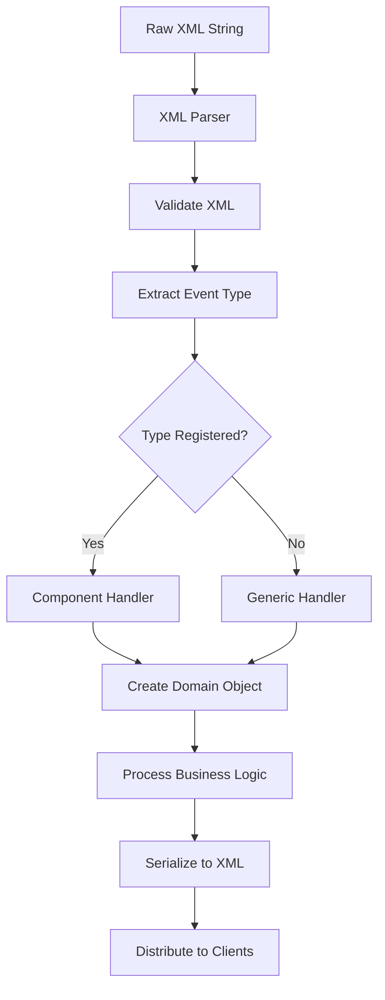

## What is Cursor on Target (CoT)?

Cursor on Target (CoT) is an XML-based data format used for real-time situational awareness and command-and-control applications. It provides a standardized way to represent position, status, and other tactical information.

## CoT Message Structure

### Basic XML Format

A CoT message consists of three main elements: `event`, `point`, and `detail`.

```xml
<?xml version="1.0" encoding="UTF-8" standalone="yes"?>
<event version="2.0" 
       uid="Linux-ABC.server-ping" 
       type="b-t-f" 
       time="2020-02-14T20:32:31.444Z" 
       start="2020-02-14T20:32:31.444Z" 
       stale="2020-02-15T20:32:31.444Z" 
       how="h-g-i-g-o">
    <point lat="34.5" lon="-117.2" hae="100.0" ce="10.0" le="5.0"/>
    <detail>
        <contact callsign="ALPHA-1"/>
        <remarks>This is a sample CoT message</remarks>
    </detail>
</event>
```

### Event Element

The root element containing metadata about the tactical event.

<ParamField path="version" type="string" required>
  Schema version of the CoT message (typically "2.0")
</ParamField>

<ParamField path="uid" type="string" required>
  Globally unique identifier for this event. Format varies by event type.
</ParamField>

<ParamField path="type" type="string" required>
  Hierarchical CoT type string (e.g., "a-f-G-E-S" for friendly ground equipment)
  
  **Format**: `a-{attitude}-{dimension}-{function}-{specific}`
  - **a**: Atom (basic entity)
  - **attitude**: f (friendly), h (hostile), n (neutral), u (unknown)
  - **dimension**: G (ground), A (air), S (surface), U (subsurface), P (space)
  - **function**: E (equipment), U (unit), I (installation), etc.
</ParamField>

<ParamField path="time" type="datetime" required>
  Timestamp when the event was generated (ISO 8601 format with Zulu time)
  
  **Format**: `YYYY-MM-DDTHH:MM:SS.fffZ`
</ParamField>

<ParamField path="start" type="datetime" required>
  Timestamp when the event becomes valid
</ParamField>

<ParamField path="stale" type="datetime" required>
  Timestamp when the event should be considered expired
  
  **Default**: 60 seconds after generation time
</ParamField>

<ParamField path="how" type="string" required>
  How the coordinates were generated
  
  **Common values**:
  - `h-g-i-g-o`: Human-generated, GPS, observed
  - `m-g`: Machine-generated, GPS
  - `h-e`: Human-entered
</ParamField>

<ParamField path="access" type="string">
  Access control restrictions for this event
</ParamField>

### Point Element

Defines the geographic location of the event.

```xml
<point lat="34.5" lon="-117.2" hae="100.0" ce="10.0" le="5.0"/>
```

<ParamField path="lat" type="float" required>
  Latitude in decimal degrees (WGS 84 ellipsoid)
  
  **Range**: -90.0 to 90.0
</ParamField>

<ParamField path="lon" type="float" required>
  Longitude in decimal degrees (WGS 84 ellipsoid)
  
  **Range**: -180.0 to 180.0
</ParamField>

<ParamField path="hae" type="float" required>
  Height Above Ellipsoid in meters
</ParamField>

<ParamField path="ce" type="float" required>
  Circular Error (horizontal accuracy) in meters
  
  95% confidence that position is within CE radius
</ParamField>

<ParamField path="le" type="float" required>
  Linear Error (vertical accuracy) in meters
  
  95% confidence that altitude is within LE range
</ParamField>

### Detail Element

Contains additional information about the event. The detail element is extensible and can contain various sub-elements based on the event type.

```xml
<detail>
    <contact callsign="ALPHA-1" endpoint="*:-1:stcp"/>
    <__group name="Red" role="Team Member"/>
    <takv platform="ATAK-CIV" version="4.5.1.13"/>
    <track speed="5.5" course="270.0"/>
    <remarks>Additional information</remarks>
</detail>
```

#### Common Detail Sub-elements

<AccordionGroup>
  <Accordion title="contact">
    Contact information for the entity
    
    **Attributes**:
    - `callsign`: Display name
    - `endpoint`: Network endpoint information
  </Accordion>

  <Accordion title="__group">
    Group/team membership information
    
    **Attributes**:
    - `name`: Group/team name
    - `role`: Role within the group
  </Accordion>

  <Accordion title="takv">
    TAK client version information
    
    **Attributes**:
    - `platform`: Platform type (ATAK-CIV, WinTAK, iTAK)
    - `version`: Client version number
  </Accordion>

  <Accordion title="track">
    Movement information
    
    **Attributes**:
    - `speed`: Speed in meters per second
    - `course`: Direction of travel in degrees (0-360)
  </Accordion>

  <Accordion title="link">
    Relationship to other CoT entities
    
    **Attributes**:
    - `uid`: UID of linked entity
    - `relation`: Relationship type
    - `type`: CoT type of linked entity
  </Accordion>

  <Accordion title="remarks">
    Free-form text remarks or notes
  </Accordion>

  <Accordion title="marti">
    Data package and file transfer information
    
    **Sub-elements**:
    - `dest`: Destination callsigns for the package
  </Accordion>

  <Accordion title="emergency">
    Emergency alert information
    
    **Attributes**:
    - `type`: Emergency type (911 Alert, Ring The Bell, etc.)
  </Accordion>
</AccordionGroup>

## CoT Type Hierarchy

### Type String Format

CoT types use a hierarchical dot-separated format:

```
atom-attitude-dimension-function-specific-[...]
```

### Common CoT Types

<Tabs>
  <Tab title="Positions">
    | Type | Description |
    |------|-------------|
    | `a-f-G-E-S` | Friendly ground equipment (static) |
    | `a-f-G-E-V-C` | Friendly ground vehicle - combat |
    | `a-f-A-C` | Friendly aircraft - civilian |
    | `a-f-A-M-F` | Friendly aircraft - military fixed wing |
    | `a-h-G-U-C` | Hostile ground unit - combat |
    | `a-n-G` | Neutral ground entity |
  </Tab>
  
  <Tab title="Messages">
    | Type | Description |
    |------|-------------|
    | `b-t-f` | TAK server ping/pong |
    | `b-m-p-s-p-loc` | Geochat message |
    | `b-m-p-c` | Chat message (point to point) |
    | `b-r-f-h-c` | Route |
    | `b-i-v` | Video stream |
  </Tab>
  
  <Tab title="Special">
    | Type | Description |
    |------|-------------|
    | `t-x-c-t` | Connection request |
    | `t-x-d-d` | Disconnect |
    | `b-a-o-tbl` | Drawing objects (polygon, line, etc) |
    | `b-m-r` | Mission package |
  </Tab>
</Tabs>

## FTS CoT Domain Model

### Event Class

The core CoT event implementation in FTS:

```python
# FreeTAKServer/components/core/domain/domain/_event.py
class Event(CoTNode):
    """Root CoT event object"""
    
    @CoTProperty
    def uid(self):
        return self.cot_attributes.get("uid", None)
    
    @uid.setter
    def uid(self, uid):
        if uid == None:
            self.uid = str(uuid.uuid1())
        else:
            self.cot_attributes["uid"] = uid
    
    @CoTProperty
    def type(self):
        return self.cot_attributes.get("type", None)
    
    @CoTProperty
    def point(self):
        return self.cot_attributes.get("point", None)
    
    @CoTProperty
    def detail(self):
        return self.cot_attributes.get("detail", None)
```

### Point Class

```python
# FreeTAKServer/components/core/domain/domain/_point.py
class point(CoTNode):
    """Geographic point representation"""
    
    def __init__(self, configuration, model, le=None, ce=None, 
                 hae=None, lon=None, lat=None):
        super().__init__(self.__class__.__name__, configuration, model)
        self.cot_attributes["le"] = le    # Linear Error
        self.cot_attributes["ce"] = ce    # Circular Error
        self.cot_attributes["hae"] = hae  # Height Above Ellipsoid
        self.cot_attributes["lon"] = lon  # Longitude
        self.cot_attributes["lat"] = lat  # Latitude
```

### Detail Class

```python
# FreeTAKServer/components/core/domain/domain/_detail.py
class detail(CoTNode):
    """Optional element for CoT sub-schema"""
    
    @CoTProperty
    def contact(self):
        return self.cot_attributes.get("contact", None)
    
    @CoTProperty
    def marti(self):
        return self.cot_attributes.get("marti", None)
    
    @CoTProperty
    def link(self):
        return self.cot_attributes.get("link", None)
    
    @CoTProperty
    def mission(self):
        return self.cot_attributes.get("mission", None)
```

## CoT Message Processing

### Parsing Pipeline



### XML to Domain Object

FTS converts XML to domain objects using a multi-step process:

```python
# FreeTAKServer/core/parsers/XMLCoTController.py:64-100
def determineCoTGeneral(self, data, client_information_queue):
    # Parse XML string
    event = etree.fromstring(data.xmlString)
    
    # Convert XML to dictionary
    request.set_action("XMLToDict")
    request.set_value("message", data.xmlString)
    actionmapper.process_action(request, response)
    data_dict = response.get_value("dict")
    
    # Convert machine-readable type to human-readable
    request.set_action("ConvertMachineReadableToHumanReadable")
    request.set_value("machine_readable_type", data_dict["event"]["@type"])
    actionmapper.process_action(request, response)
    human_type = response.get_value("human_readable_type")
    
    # Route to appropriate handler based on type
    return (human_type, data)
```

### Type Mapping

FTS maintains mappings between machine-readable and human-readable CoT types:

**Machine-Readable** → **Human-Readable**
- `a-f-G-E-S` → "FriendlyGroundEquipment"
- `b-m-p-s-p-loc` → "GeoChat"
- `b-t-f` → "Ping"
- `a-f-G-E-V-C` → "FriendlyGroundVehicle"

This allows routing to specific component handlers.

## Serialization

### Domain Object to XML

```python
# FreeTAKServer/components/core/domain/controllers/serialization/xml_serialization/xml_serializer.py
class XmlSerializer(SerializerAbstract):
    def serialize_model_to_CoT(self, modelObject, tagName="event", level=0):
        # Convert type back to machine-readable
        if modelObject.__class__.__name__ == "Event":
            request.set_action("ConvertHumanReadableToMachineReadable")
            request.set_value("human_readable_type", modelObject.type)
            modelObject.type = response.get_value("machine_readable_type")
        
        # Create XML element
        xml = Element(tagName)
        
        # Add attributes from CoT properties
        for attribName in modelObject.get_properties():
            value = getattr(modelObject, attribName)
            if hasattr(value, "__dict__"):
                # Nested object - recurse
                tagElement = self.serialize_model_to_CoT(value, attribName)
                xml.append(tagElement)
            else:
                # Simple attribute
                xml.set(attribName, str(value))
        
        return xml
```

## Common CoT Message Examples

### Presence/Position Update

```xml
<event version="2.0" uid="ANDROID-deadbeef" type="a-f-G-E-S" 
       time="2024-03-04T12:00:00.000Z" 
       start="2024-03-04T12:00:00.000Z" 
       stale="2024-03-04T12:01:00.000Z" 
       how="m-g">
    <point lat="34.5" lon="-117.2" hae="100.0" ce="10.0" le="5.0"/>
    <detail>
        <contact callsign="ALPHA-1" endpoint="*:-1:stcp"/>
        <__group name="Red" role="Team Member"/>
        <takv platform="ATAK-CIV" version="4.5.1.13"/>
        <track speed="5.5" course="270.0"/>
    </detail>
</event>
```

### GeoChat Message

```xml
<event version="2.0" uid="GeoChat.ANDROID-deadbeef.All Chat Rooms.abc123" 
       type="b-t-f" 
       time="2024-03-04T12:00:00.000Z" 
       start="2024-03-04T12:00:00.000Z" 
       stale="2024-03-04T12:10:00.000Z" 
       how="h-e">
    <point lat="0.0" lon="0.0" hae="0.0" ce="9999999.0" le="9999999.0"/>
    <detail>
        <__chat id="All Chat Rooms" chatroom="All Chat Rooms" 
                groupOwner="false" messageId="abc123" 
                senderCallsign="ALPHA-1">
            <chatgrp uid0="ANDROID-deadbeef" uid1="All Chat Rooms" id="All Chat Rooms"/>
        </__chat>
        <link uid="ANDROID-deadbeef" type="a-f-G-E-S" relation="p-p"/>
        <remarks source="BAO.F.ATAK.ANDROID-deadbeef" 
                 time="2024-03-04T12:00:00.000Z">
            Hello from ALPHA-1
        </remarks>
    </detail>
</event>
```

### Emergency Alert

```xml
<event version="2.0" uid="ANDROID-deadbeef" type="b-a-o-tbl" 
       time="2024-03-04T12:00:00.000Z" 
       start="2024-03-04T12:00:00.000Z" 
       stale="2024-03-04T12:10:00.000Z" 
       how="h-e">
    <point lat="34.5" lon="-117.2" hae="100.0" ce="10.0" le="5.0"/>
    <detail>
        <contact callsign="ALPHA-1"/>
        <emergency type="911 Alert" cancel="false"/>
        <link uid="ANDROID-deadbeef" type="a-f-G-E-S" relation="p-p"/>
    </detail>
</event>
```

### Data Package

```xml
<event version="2.0" uid="package-abc123" type="b-m-r" 
       time="2024-03-04T12:00:00.000Z" 
       start="2024-03-04T12:00:00.000Z" 
       stale="2024-03-04T13:00:00.000Z" 
       how="h-e">
    <point lat="0.0" lon="0.0" hae="0.0" ce="9999999.0" le="9999999.0"/>
    <detail>
        <fileshare filename="image.jpg" senderUrl="https://server:8080/Marti/api/sync/content?hash=abc123" 
                   sizeInBytes="524288" sha256="abc123..." 
                   senderUid="ANDROID-deadbeef" senderCallsign="ALPHA-1" 
                   name="image.jpg"/>
        <ackrequest uid="package-abc123" ackrequested="true" tag="package-abc123"/>
        <marti>
            <dest callsign="BRAVO-1"/>
        </marti>
    </detail>
</event>
```

## Special Considerations

### Time Handling

<Warning>
  All timestamps must be in ISO 8601 format with Zulu (UTC) time:
  `YYYY-MM-DDTHH:MM:SS.fffZ`
  
  Default stale time is 60 seconds after generation.
</Warning>

### UID Format

<Info>
  UIDs should be globally unique. Common patterns:
  - Position updates: `{platform}-{device-id}` (e.g., `ANDROID-deadbeef`)
  - GeoChat: `GeoChat.{sender-uid}.{chatroom}.{message-id}`
  - Server events: `{hostname}.server-ping`
</Info>

### Coordinate System

<Note>
  All coordinates use WGS 84 ellipsoid:
  - Latitude: -90° to 90° (negative = south)
  - Longitude: -180° to 180° (negative = west)
  - HAE: Height above WGS 84 ellipsoid in meters
</Note>

## Related Documentation

<CardGroup cols={2}>
  <Card title="Architecture" icon="sitemap" href="/concepts/architecture">
    Understand FTS architecture
  </Card>
  <Card title="Services" icon="server" href="/concepts/services">
    Learn about FTS services
  </Card>
  <Card title="Components" icon="puzzle-piece" href="/concepts/components">
    Explore the component system
  </Card>
  <Card title="API Reference" icon="code" href="/api/overview">
    REST API documentation
  </Card>
</CardGroup>