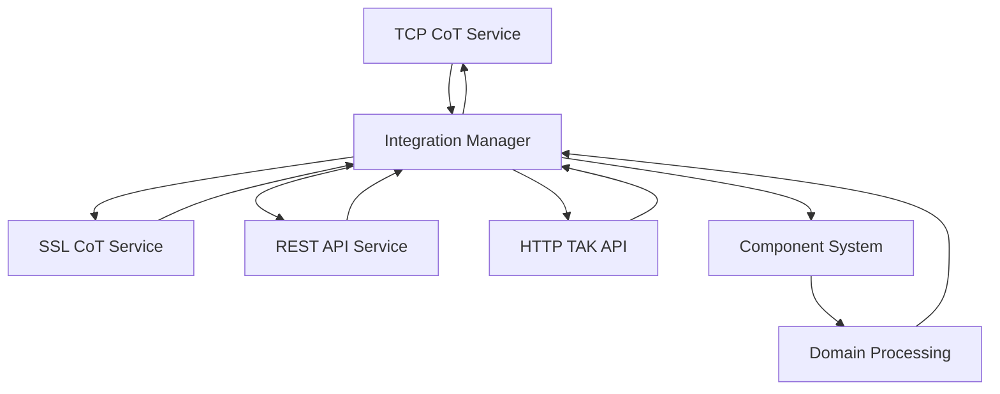

## Service Architecture

FreeTAKServer implements a modular service architecture where each service runs independently and communicates through a central integration manager. All services extend the `DigitalPyService` base class from the DigitalPy framework.

## Available Services

### TCP CoT Service

The TCP CoT Service handles unencrypted Cursor on Target traffic over TCP connections.

**Implementation**: `FreeTAKServer/services/tcp_cot_service/`

<AccordionGroup>
  <Accordion title="Service Details">
    **Main Class**: `TCPCoTServiceMain`
    
    ```python
    # FreeTAKServer/services/tcp_cot_service/tcp_cot_service_main.py:73
    class TCPCoTServiceMain(DigitalPyService):
        """Service responsible for handling CoT listener for XML"""
        
        def __init__(
            self,
            service_id,
            subject_address,
            subject_port,
            subject_protocol,
            integration_manager_address,
            integration_manager_port,
            integration_manager_protocol,
            formatter: Formatter,
        ):
            super().__init__(
                service_id,
                subject_address,
                subject_port,
                subject_protocol,
                integration_manager_address,
                integration_manager_port,
                integration_manager_protocol,
                formatter
            )
    ```
  </Accordion>

  <Accordion title="Key Features">
    - **Protocol**: TCP/IP without encryption
    - **Port**: Default 8087
    - **Format**: XML-based CoT messages
    - **Use Case**: Development, testing, local networks
    - **Multi-threaded**: Concurrent client handling via thread pools
  </Accordion>

  <Accordion title="Controllers">
    Located in `FreeTAKServer/services/tcp_cot_service/controllers/`:
    
    - **TCPSocketController**: Manages TCP socket creation and binding
    - **ReceiveConnections**: Accepts incoming client connections
    - **ClientConnectionController**: Handles new client setup
    - **ClientReceptionHandler**: Receives data from connected clients
    - **SendDataController**: Sends CoT messages to clients
    - **ClientDisconnectionController**: Handles client disconnection cleanup
    - **SendComponentDataController**: Sends data from component processing
  </Accordion>

  <Accordion title="Connection Flow">
    ```mermaid
    sequenceDiagram
        participant Client
        participant TCPSocket
        participant ConnHandler
        participant Reception
        participant Processing
        
        Client->>TCPSocket: Connect
        TCPSocket->>ConnHandler: New connection
        ConnHandler->>Reception: Start reception thread
        Reception->>Processing: Forward CoT XML
        Processing->>Reception: Processed data
        Reception->>Client: Send response
    ```
  </Accordion>
</AccordionGroup>

### SSL CoT Service

The SSL CoT Service provides encrypted CoT traffic using SSL/TLS certificates.

**Implementation**: `FreeTAKServer/services/ssl_cot_service/`

<AccordionGroup>
  <Accordion title="Service Details">
    **Main Class**: `SSLCoTServiceController`
    
    **Features**:
    - SSL/TLS encrypted connections
    - X.509 certificate authentication
    - Default port: 8089
    - Client certificate validation
  </Accordion>

  <Accordion title="Certificate Management">
    FTS uses the `AtakOfTheCerts` utility for certificate generation:
    
    ```python
    from FreeTAKServer.core.util.certificate_generation import AtakOfTheCerts
    
    # Certificate operations:
    # - Generate CA certificates
    # - Create server certificates
    # - Generate client certificates
    # - Sign certificates with CA
    ```
    
    **Certificate Locations**:
    - CA Certificate: `certs/ca.pem`
    - Server Certificate: `certs/server.pem`
    - Client Certificates: `certs/clients/{username}.pem`
  </Accordion>

  <Accordion title="Security Features">
    - **Mutual TLS**: Both server and client authentication
    - **Certificate Validation**: Verify client certificates against CA
    - **Encrypted Transport**: All CoT data encrypted in transit
    - **Certificate Revocation**: Support for certificate blacklisting
  </Accordion>
</AccordionGroup>

### REST API Service

The REST API Service provides a web-based interface for CoT manipulation, system management, and integration.

**Implementation**: `FreeTAKServer/services/rest_api_service/`

<AccordionGroup>
  <Accordion title="Service Details">
    **Main Class**: `RestAPIServiceMain`
    
    **Framework**: Flask with SocketIO
    
    ```python
    # FreeTAKServer/services/rest_api_service/rest_api_service_main.py
    app = Flask(__name__)
    CORS(app)
    socketio = SocketIO(app, async_handlers=True, async_mode="eventlet")
    socketio.init_app(app, cors_allowed_origins="*")
    ```
    
    **Ports**:
    - HTTP: Default 19023
    - WebSocket: Same port as HTTP
  </Accordion>

  <Accordion title="API Endpoints">
    The REST API is organized into blueprints:
    
    **Core Endpoints**:
    - `/ManagePresence` - Position/presence management
    - `/ManageEmergency` - Emergency alerts
    - `/ManageGeoObject` - Geographic objects (markers, shapes)
    - `/ManageRoute` - Route planning
    - `/ManageChat` - Chat messages
    - `/VideoStream` - Video stream management
    - `/Sensor` - Sensor data
    - `/ExCheck` - Checklist management
    
    **System Endpoints**:
    - `/APIUser` - User authentication
    - `/ManageConnection` - Connection management
    - `/Health` - Health checks
  </Accordion>

  <Accordion title="WebSocket Support">
    Real-time updates via Socket.IO:
    
    ```javascript
    // Client connection
    const socket = io('http://server:19023');
    
    // Subscribe to CoT events
    socket.emit('subscribe', {type: 'presence'});
    
    // Receive updates
    socket.on('cotEvent', (data) => {
        console.log('New CoT:', data);
    });
    ```
    
    **Event Types**:
    - `cotEvent` - New CoT message
    - `presence` - Position updates
    - `chat` - Chat messages
    - `emergency` - Emergency alerts
  </Accordion>

  <Accordion title="Authentication">
    **Methods**:
    - **Session-based**: Flask-Login sessions
    - **Token-based**: API key authentication
    - **Certificate-based**: Client certificate validation
    
    ```python
    # FreeTAKServer/services/rest_api_service/controllers/authentication.py
    from flask_login import LoginManager, login_required
    
    @app.route('/protected')
    @login_required
    def protected_endpoint():
        return jsonify({'status': 'authenticated'})
    ```
  </Accordion>
</AccordionGroup>

### HTTP TAK API Service

Implements the TAK server HTTP API for compatibility with TAK clients.

**Implementation**: `FreeTAKServer/services/http_tak_api_service/`

<AccordionGroup>
  <Accordion title="Service Details">
    **Main Class**: `HTTPTakAPI`
    
    **Purpose**: Provides TAK-compatible HTTP endpoints for:
    - Mission package synchronization
    - Data package upload/download
    - Video stream metadata
    - CoT query API
    
    **Port**: Default 8080
  </Accordion>

  <Accordion title="Key Endpoints">
    **Marti API Compatibility**:
    
    - `GET /Marti/api/sync/metadata/{hash}` - Get package metadata
    - `GET /Marti/api/sync/content` - Download package
    - `PUT /Marti/api/sync/upload` - Upload data package
    - `GET /Marti/api/missions` - List missions
    - `GET /Marti/api/missions/{name}` - Get mission details
    - `POST /Marti/api/missions/{name}/changes` - Submit mission changes
  </Accordion>

  <Accordion title="Data Package Handling">
    ```python
    # Upload data package
    PUT /Marti/api/sync/upload
    Content-Type: multipart/form-data
    
    # Response includes:
    {
        "hash": "abc123...",
        "sizeInBytes": 524288,
        "submissionTime": "2024-03-04T12:00:00.000Z"
    }
    
    # Download via hash
    GET /Marti/api/sync/content?hash=abc123...
    ```
  </Accordion>
</AccordionGroup>

### HTTPS TAK API Service

Secure version of the HTTP TAK API Service with SSL/TLS encryption.

**Implementation**: `FreeTAKServer/services/https_tak_api_service/`

<AccordionGroup>
  <Accordion title="Service Details">
    **Main Class**: `HTTPSTakAPI`
    
    **Features**:
    - All HTTP TAK API endpoints over HTTPS
    - Certificate-based client authentication
    - Encrypted data package transfers
    
    **Port**: Default 8443
  </Accordion>

  <Accordion title="Configuration">
    ```python
    # SSL context configuration
    ssl_context = ssl.SSLContext(ssl.PROTOCOL_TLS_SERVER)
    ssl_context.load_cert_chain(
        certfile='certs/server.pem',
        keyfile='certs/server.key'
    )
    ssl_context.load_verify_locations('certs/ca.pem')
    ssl_context.verify_mode = ssl.CERT_REQUIRED
    ```
  </Accordion>
</AccordionGroup>

## Service Communication

### Integration Manager Pattern

Services communicate through a central integration manager using ZeroMQ:



### Message Flow

```python
# Service sends to integration manager
request = ObjectFactory.get_new_instance("request")
request.set_value("cot_event", event)
request.set_action("ProcessCoT")

# Integration manager routes to components
self.integration_manager.send(request)

# Components process and respond
response = self.integration_manager.receive()

# Service receives processed result
processed_event = response.get_value("processed_cot")
```

## Service Lifecycle

### Initialization

```python
# FreeTAKServer/controllers/services/FTS.py
class FTS(DigitalPy):
    def __init__(self):
        super().__init__()
        
        # Initialize services
        self.SSLCoTService = None
        self.CoTService = None
        self.TCPDataPackageService = None
        self.RestAPIService = None
        
    def start_services(self):
        # Start TCP CoT Service
        self.CoTService = TCPCoTServiceMain(
            service_id="tcp_cot_service",
            subject_address=config.CoTIPAddress,
            subject_port=config.CoTServicePort,
            ...
        )
        self.CoTService.start()
        
        # Start SSL CoT Service
        self.SSLCoTService = SSLCoTServiceController(
            service_id="ssl_cot_service",
            ...
        )
        self.SSLCoTService.start()
        
        # Start REST API
        self.RestAPIService.start()
```

### Shutdown

```python
def stop_services(self):
    # Graceful shutdown
    self.CoTService.stop()
    self.SSLCoTService.stop()
    self.RestAPIService.stop()
    
    # Wait for threads to finish
    self.CoTService.join()
    self.SSLCoTService.join()
    self.RestAPIService.join()
```

## Service Configuration

### Configuration File

Services are configured via `config.ini`:

```ini
[CoTService]
ip = 0.0.0.0
port = 8087

[SSLCoTService]
ip = 0.0.0.0
port = 8089
certfile = /opt/fts/certs/server.pem
keyfile = /opt/fts/certs/server.key
cafile = /opt/fts/certs/ca.pem

[RestAPI]
ip = 0.0.0.0
port = 19023
secret_key = your-secret-key-here

[HTTPTakAPI]
ip = 0.0.0.0
http_port = 8080
https_port = 8443
```

### Environment Variables

Override configuration with environment variables:

```bash
export FTS_COT_PORT=8087
export FTS_SSL_COT_PORT=8089
export FTS_API_PORT=19023
export FTS_MAINPATH=/opt/fts
```

## Performance Considerations

### Thread Pool Configuration

```python
# Adjust thread pool sizes based on load
from multiprocessing.pool import ThreadPool

# Connection handling pool
connection_pool = ThreadPool(processes=50)

# Message processing pool
processing_pool = ThreadPool(processes=20)
```

### Connection Limits

<Warning>
  Monitor concurrent connections and adjust system limits:
  
  ```bash
  # Increase file descriptor limit
  ulimit -n 4096
  
  # Configure in systemd service
  [Service]
  LimitNOFILE=4096
  ```
</Warning>

### Database Connection Pooling

```python
# SQLAlchemy connection pool
from sqlalchemy import create_engine

engine = create_engine(
    connection_string,
    pool_size=20,
    max_overflow=40,
    pool_recycle=3600
)
```

## Monitoring and Health Checks

### Health Check Endpoint

```python
# REST API health check
GET /Health

Response:
{
    "status": "healthy",
    "services": {
        "tcp_cot": "running",
        "ssl_cot": "running",
        "rest_api": "running"
    },
    "connections": 42,
    "uptime": 86400
}
```

### Telemetry

```python
from opentelemetry.trace import Status, StatusCode
from digitalpy.core.telemetry.tracer import Tracer

# Service metrics
tracer = Tracer("tcp_cot_service")

with tracer.start_span("process_cot") as span:
    span.set_attribute("cot.type", cot_type)
    span.set_attribute("client.id", client_id)
    # Process message
    span.set_status(Status(StatusCode.OK))
```

## Troubleshooting

### Common Issues

<AccordionGroup>
  <Accordion title="Port Already in Use">
    ```bash
    # Find process using port
    sudo lsof -i :8087
    
    # Kill process
    sudo kill -9 <PID>
    
    # Or change port in config.ini
    ```
  </Accordion>

  <Accordion title="Certificate Errors">
    ```bash
    # Regenerate certificates
    cd /opt/fts
    python -m FreeTAKServer.controllers.certificate_generation
    
    # Verify certificate validity
    openssl x509 -in certs/server.pem -text -noout
    ```
  </Accordion>

  <Accordion title="Database Connection Failures">
    ```python
    # Check database connectivity
    from FreeTAKServer.core.persistence.DatabaseController import DatabaseController
    
    db = DatabaseController()
    if db.test_connection():
        print("Database OK")
    else:
        print("Database connection failed")
    ```
  </Accordion>

  <Accordion title="High Memory Usage">
    - Reduce thread pool sizes
    - Enable database connection pooling
    - Implement message rate limiting
    - Monitor for memory leaks in custom components
  </Accordion>
</AccordionGroup>

## Related Documentation

<CardGroup cols={2}>
  <Card title="Architecture" icon="sitemap" href="/concepts/architecture">
    Understand FTS architecture
  </Card>
  <Card title="Components" icon="puzzle-piece" href="/concepts/components">
    Explore the component system
  </Card>
  <Card title="Configuration" icon="gear" href="/configuration/main-config">
    Configure FTS services
  </Card>
  <Card title="API Reference" icon="code" href="/api/overview">
    REST API documentation
  </Card>
</CardGroup>